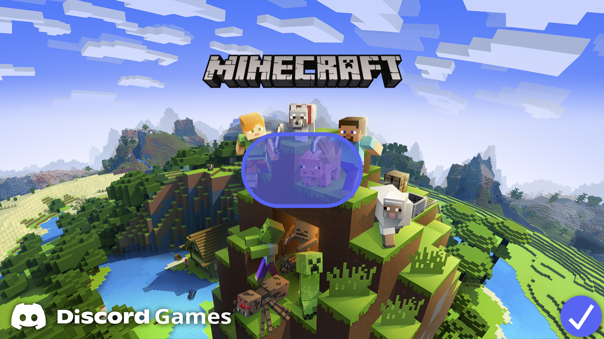
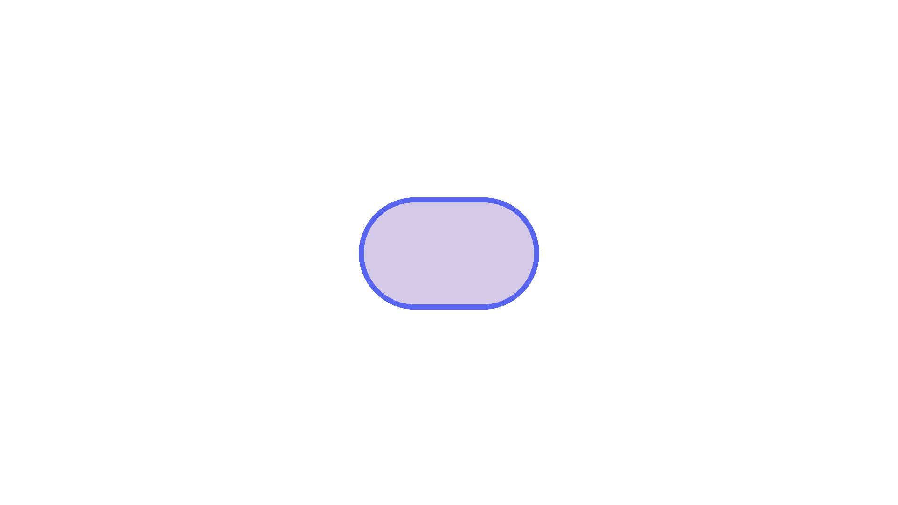

# Play Minecraft in Discord
- 当你找到这里的时候，可能有三种情况：
  - 你在游览我的github pages看到了这个
  - 你被我钓鱼了，所以逆向搜索找到这里来
  - 你知道这东西是怎么来的，当然你也抓到这个链接的来源
- 首先先跟各位说 2023年愚人节快乐 :D
  - 在discord里面玩麦块这件事本来就很不现实，如果你真的点进去了，那被rick roll也只能说6 XD

# 使用方法
-  的海带有一种bug，就是当你塞了足够多的海带的时候，后面的链接会自动被隐藏，但是embed可以生成。
- 使用代码非常简单，如下：
```
||​||||​||||​||||​||||​||||​||||​||||​||||​||||​||||​||||​||||​||||​||||​||||​||||​||||​||||​||||​||||​||||​||||​||||​||||​||||​||||​||||​||||​||||​||||​||||​||||​||||​||||​||||​||||​||||​||||​||||​||||​||||​||||​||||​||||​||||​||||​||||​||||​||||​||||​||||​||||​||||​||||​||||​||||​||||​||||​||||​||||​||||​||||​||||​||||​||||​||||​||||​||||​||||​||||​||||​||||​||||​||||​||||​||||​||||​||||​||||​||||​||||​||||​||||​||||​||||​||||​||||​||||​||||​||||​||||​||||​||||​||||​||||​||||​||||​||||​||||​||||​||||​||||​||||​||||​||||​||||​||||​||||​||||​||||​||||​||||​||||​||||​||||​||||​||||​||||​||||​||||​||||​||||​||||​||||​||||​||||​||||​||||​||||​||||​||||​||||​||||​||||​||||​||||​||||​||||​||||​||||​||||​||||​||||​||||​||||​||||​||||​||||​||||​||||​||||​||||​||||​||||​||||​||||​||||​||||​||||​||||​||||​||||​||||​||||​||||​||||​||||​||||​||||​||||​||||​||||​||||​||||​||||​||||​||||​||||​||||​||||​||||​||||​||||​||||​||||​||||​||||​||||​||||​||||​||||​||||​||||​||||​||||​||||​||||​|| _ _ _ _ _ _  https://eaglepb2.github.io/minecraft_in_discord/
```
- 就这么简单，你可以拿这条链接继续骗你的朋友了 :D

# 原理
-  处理embed的方法有点特别，例如它会把推特的封面图取代其他任何网页的封面图。
- 所以我们只需要在meta的部分新增这样一个tag：
```html
<meta name="twitter:image" content="{你的图片链接}">
```
- 图片方面的话，你可能需要一个模板，这个档案已经提供一个模板给你了:

- 所以某种程度上，你也可以拿来伪装成其他游戏 继续钓鱼咯ouob
